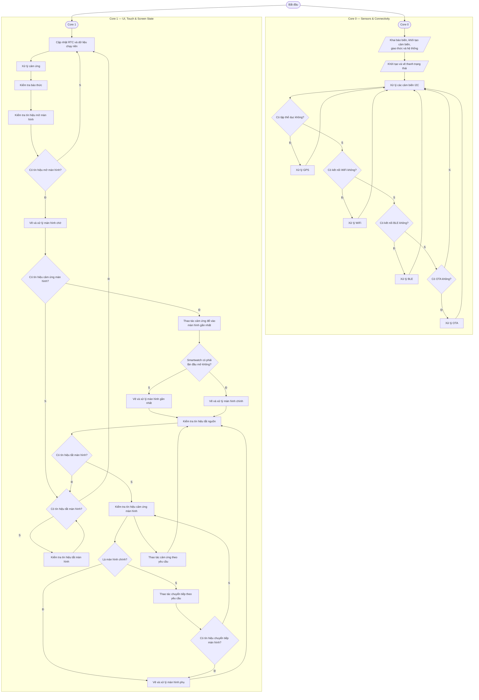

# Smartwatch Integration System (ESP32-S3 + BLE + Flutter App)

[](https://docs.espressif.com/projects/esp-idf/en/release-v5.5/index.html)
[](https://lvgl.io/)
[](https://flutter.dev/)
[-purple.svg)](#system-behavior--workflow)
[](LICENSE)

A comprehensive wearable IoT solution utilizing **ESP32-S3** and **FreeRTOS** paired with a **Flutter companion mobile app** via **Bluetooth Low Energy (BLE)**. The smartwatch features real-time health monitoring (Heart Rate, SpO2), GPS route tracking, Google Maps turn-by-turn navigation mirroring, local alarm scheduling, a device settings customizer, and a smooth, modern UI rendered using **LVGL**.

---

## 📑 Table of Contents

- [Demo](#-demo)
- [Key Features](#-key-features)
- [Tech Stack & Hardware](#️-requirements)
- [System Behavior & Workflow](#-system-behavior--workflow)
- [Hardware Connections](#-hardware-connections)
- [Getting Started](#-getting-started)
- [Project Structure](#️-project-structure)
- [System Protection](#️-system-protection)
- [Gallery](#️-gallery)
- [Author](#-author-information)

---

## 📷 Demo

<!--
  TODO: replace with the real hero shot committed to the repo, e.g. under
  /docs/images/ — do NOT use local disk paths (D:\...), they will never
  render on GitHub. Pick the single most impressive photo/screenshot here
  (watchface on wrist, or the UI in action); the rest of the gallery is
  further down before the video demo.
-->

<p align="center">
  
</p>

---

## 📌 Key Features

* **Real-time Telemetry Mirroring:** Syncs heart rate, SpO2, step count, activity modes, and battery status directly to the Flutter companion app.
* **Google Maps Navigation Sync:** Mirrors navigation steps (turn directions, distance to next turn) from the smartphone to the watch screen via BLE.
* **Dual-Mode Fitness Tracking:**
  * **Walking Mode:** Tracks and displays step count and cumulative distance.
  * **Cycling Mode:** Tracks and displays speed and distance using GPS data.
* **Autonomous GPS Tracking:** Logs coordinates, speed, and paths to the local filesystem (SPIFFS), fully synced to the mobile app for route plotting on Google Maps.
* **Health Dashboard:** Integrates MAX30102 for heart rate and blood oxygen saturation (SpO2) readings.
* **Custom UI & Touch (LVGL):** High-priority GUI thread for smooth scrolling and swipe navigation on a 1.83" TFT display using CST816S touch.
* **Power-saving OTA:** Local Wi-Fi is enabled *only* for Over-the-Air firmware updates to maximize battery life.

---

## ⚙️ Requirements

* **ESP-IDF Toolchain:** v5.5.2 (NimBLE for BLE, ESP-LCD for screen drivers)
* **Mobile App:** Flutter SDK (Dart)
* **Hardware Components:**
  * **ESP32-S3 (N8R2):** 8MB Flash, 2MB PSRAM.
  * **External 32.768 kHz Crystal:** Dedicated external crystal for accurate RTC timekeeping without a standalone RTC module.
  * **1.83" TFT LCD:** 240x284 resolution (ST7789 driver).
  * **CST816S:** Capacitive touch controller.
  * **MAX17048G:** Battery fuel gauge sensor (I2C).
  * **BMI270:** 6-axis IMU for step tracking and sleep tracking (I2C).
  * **MAX30102:** Integrated pulse oximetry and heart rate monitor sensor (I2C).
  * **GT-U8 GNSS Module:** GPS receiver (UART).
  * **Coin Vibration Motor:** Controlled via PWM (LEDC) for haptic feedback.

---

## 🧠 Memory Management (PSRAM Configuration)

To optimize the limited internal SRAM, the system splits memory allocations with the 2MB external PSRAM:

* **PSRAM (2MB) is allocated for:**
  * LVGL frame buffers (double-buffered for smooth rendering).
  * Pre-compiled images and custom fonts (`font_12.c` to `font_48.c`).
  * GPS path buffers (high-capacity coordinate tables).
  * Audio processing buffers (for future I2S microphone logs).
* **PSRAM is NOT used for (kept in fast internal SRAM):**
  * High-priority RTOS task stacks.
  * Real-time variables (e.g. state machines, BLE callback variables).

---

## 🔌 Hardware Connections

### DC Signal Connections

| Peripheral | Pin Name | ESP32-S3 GPIO | Connection Type & Notes |
| :--- | :--- | :--- | :--- |
| **ST7789 LCD** | SCLK | **GPIO 40** | SPI Clock |
| | MOSI (SDA) | **GPIO 39** | SPI Master Out Slave In |
| | RST | **GPIO 38** | Reset Pin |
| | DC | **GPIO 42** | Data/Command Selection |
| | CS | **GPIO 41** | SPI Chip Select |
| | BLK | **GPIO 2** | Backlight Control (PWM LEDC Low Speed) |
| **CST816S Touch** | SDA | **GPIO 48** | I2C Port 0 Data (requires pull-up) |
| | SCL | **GPIO 47** | I2C Port 0 Clock (requires pull-up) |
| | INT | **GPIO 14** | Interrupt Pin (triggered on touch) |
| | RST | **GPIO 21** | Reset Pin |
| **Sensor Bus** | SDA | **GPIO 19** | I2C Port 1 Shared Data (IMU, HR, Fuel Gauge) |
| | SCL | **GPIO 8** | I2C Port 1 Shared Clock (IMU, HR, Fuel Gauge) |
| | IMU INT | **GPIO 20** | BMI270 Interrupt |
| | HR INT | **GPIO 13** | MAX30102 Interrupt |
| | BAT ALRT | **GPIO 11** | MAX17048G Low Battery Alert |
| **Haptic Motor** | VIB | **GPIO 12** | Vibration Motor PWM (LEDC Low Speed) |
| **Power Button** | KEY | **GPIO 1** | Boot Mode / Wakeup / Power Key |
| **GT-U8 GPS** | TX | **GPIO 5** | UART 1 TX (connected to GPS RX) |
| | RX | **GPIO 6** | UART 1 RX (connected to GPS TX) |
| | PPS | **GPIO 4** | Pulse-Per-Second synchronization |

---

## 🚀 Getting Started

### 1. Set up ESP-IDF (v5.5.2)

```bash
git clone -b v5.5.2 --recursive https://github.com/espressif/esp-idf.git
cd esp-idf
./install.sh
. ./export.sh
```

### 2. Clone this repository

```bash
git clone https://github.com/HuynhTran112/esp32-smartwatch.git
cd esp32-smartwatch
```

### 3. Configure and build

```bash
idf.py set-target esp32s3
idf.py menuconfig   # optional, defaults are provided via sdkconfig
idf.py build
```

### 4. Flash and monitor

```bash
idf.py -p /dev/ttyUSB0 flash monitor   # replace with your COM port on Windows
```

### 5. Run the companion app

```bash
cd app
flutter pub get
flutter run
```

---

## 🔄 System Behavior & Workflow

The firmware runs as two cooperating loops pinned to the ESP32-S3's dual cores: **Core 0** owns sensors, connectivity, and background services; **Core 1** owns the LVGL UI, touch input, and screen state machine.


> Sơ đồ trên được dựng lại từ file drawio gốc để hiển thị trên GitHub (Mermaid). Một vài nhánh rẽ phụ đã được đơn giản hoá cho dễ đọc — tham khảo file `.drawio` gốc trong repo nếu cần độ chính xác tuyệt đối.

### 1. Boot & Task Split
* `app_main.c` initializes NVS/SPIFFS and hardware once at boot.
* Two pinned tasks are then spun up: **Core 0** (sensors, connectivity, OTA) and **Core 1** (LVGL UI, screen state machine).
* Splitting the work keeps display rendering isolated from I/O, so touch and animations stay smooth regardless of sensor/network load.

### 2. Core 0 — Sensor & Connectivity Loop
* Declares buffers, initializes sensors/protocols, draws the status bar once.
* Then polls each I2C sensor in a tight round-robin loop.
* On every pass, checks in order and services whichever is active:
  * Workout active → update GPS
  * Wi-Fi connected → service Wi-Fi
  * BLE connected → service BLE
  * OTA requested → run OTA flow
* Loops back to the next I2C read.

### 3. Core 1 — Screen Wake & Standby
* Continuously refreshes RTC/background data, polls touch, checks alarm and wake signal.
* Screen off → stays in this lightweight background loop.
* Wake signal detected → renders the lock/standby screen, watches for touch or screen-off.
* Screen turned off again → returns straight to the background loop.

### 4. Core 1 — Screen Navigation
* A touch on the standby screen opens the most recently used screen (main screen on first boot, otherwise the last screen shown).
* From there, each touch is classified as either:
  * Navigation on the current (secondary) screen, or
  * A transition request to another screen
* Every path routes back through a power-off check, so the watch can drop to standby or shut down from anywhere in the navigation tree.

### 5. Wi-Fi OTA Updates
* Wi-Fi stays disabled during normal use to conserve power.
* On update request: connect to Wi-Fi → fetch new binary → write via ESP-OTA partition APIs → restart automatically.

---

## 🗂️ Project Structure

```
esp32-smartwatch/
├── CMakeLists.txt              # Top-level build configuration
├── partitions_custom.csv       # Custom partitioning (app, spiffs, nvs)
├── sdkconfig                   # Project configuration settings
├── main/
│   ├── CMakeLists.txt          # Main component build configuration
│   ├── Kconfig.projbuild       # Project configuration settings for menuconfig
│   └── app_main.c              # System initialization, task management & RTOS setup
├── components/
│   ├── assets/                 # Graphics (angle, arrow, battery, wifi icons) and fonts (12px–48px)
│   ├── bluetooth/               # NimBLE BLE manager, notification handler, navigation command sync
│   ├── drivers/                 # vibration_motor.c/h driver and board_config.h pin layout
│   ├── network/                 # WiFi station manager & HTTPS OTA service
│   ├── sensors/                 # Drivers: battery (MAX17048G), IMU (BMI270), GPS (GT-U8 parser), heart rate (MAX30102)
│   ├── services/                # SPIFFS log manager (watch_activity_log) and NVS config (watch_settings)
│   └── ui/                      # LVGL screen managers (watchface, menu, navigation, health, wifi, alarm, notifications, OTA progress)
└── app/                        # Flutter companion mobile app
```

---

## 🛡️ System Protection

* **UI Guard Watchdog Timer:** A dedicated software timer checks LVGL execution heartbeats every 10s. If the GUI thread stalls for more than 30s, the watch executes `esp_restart()` to prevent permanent lockup.
* **BLE Auto-Reconnection:** The watch re-advertises immediately on connection drops so the companion app can restore streams seamlessly.
* **Thread Safety:** Mutexes protect SPIFFS write channels during GPS log writes, preventing corruption from multi-task collisions.

---

## 🖼️ Gallery

<!--
  TODO: same rule as above — commit real files under /docs/images/, no
  local disk paths.
-->

| PCB Preview | Watchface UI | Enclosure |
| :---: | :---: | :---: |
|  |  |  |

🎥 **Demo video:** _[add a real YouTube/Drive link here once recorded]_

---

## 👥 Author Information

* **Author:** Trần Huỳnh
* **Major:** Computer Engineering Technology
* **Faculty:** Faculty of Electrical and Electronics Engineering (FEEE)
* **Institution:** Ho Chi Minh City University of Technology and Education (HCMUTE)
* **Email:** [huynhtran30112004@gmail.com](mailto:huynhtran30112004@gmail.com)
