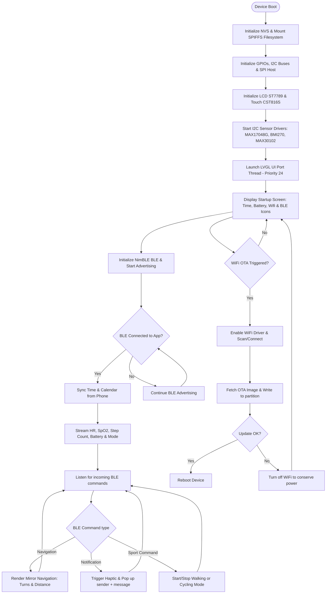

# Smartwatch Integration System (ESP32-S3 + BLE + Flutter App)

[](https://docs.espressif.com/projects/esp-idf/en/release-v5.5/index.html)
[](https://lvgl.io/)
[](https://flutter.dev/)
[-purple.svg)](#system-behavior--workflow)

A comprehensive wearable IoT solution utilizing **ESP32-S3** and **FreeRTOS** paired with a **Flutter companion mobile app** via **Bluetooth Low Energy (BLE)**. The smartwatch features real-time health monitoring (Heart Rate, SpO2), GPS route tracking, Google Maps turn-by-turn navigation mirroring, local alarm scheduling, device setting customizer, and a smooth, modern UI rendered using **LVGL**.

---

## 📌 Key Features

* **Real-time Telemetry Mirroring:** Syncs heart rate, SpO2, step count, activity modes, and battery status directly to the Flutter companion app.
* **Google Maps Navigation Sync:** Mirror navigation steps (Turn directions, distance to next turn) from your smartphone to the watch screen via BLE.
* **Dual-Mode Fitness Tracking:**
  * **Walking Mode:** Tracks and displays step count and cumulative distance.
  * **Cycling Mode:** Tracks and displays speed and distance using GPS data.
* **Autonomous GPS Tracking:** Logs coordinates, speed, and paths to the local filesystem (SPIFFS) which are fully synced to the mobile app for route plotting on Google Maps.
* **Health Dashboard:** Integrates MAX30102 for heart rate and blood oxygen saturation (SpO2) readings.
* **Custom UI & Touch (LVGL):** High-priority GUI thread for smooth scrolling and swipe navigation on a 1.83" TFT display using CST816S touch.
* **Power-saving OTA:** Local WiFi connection is enabled *only* for Over-the-Air firmware updates to maximize battery life.

---

## ⚙️ Requirements

* **ESP-IDF Toolchain:** v5.5.2 (Using NimBLE for BLE and ESP-LCD for screen drivers)
* **Mobile App:** Flutter SDK (Dart)
* **Hardware Components:**
  * **ESP32-S3 (N8R2):** 8MB Flash, 2MB PSRAM.
  * **External 32.768 kHz Crystal:** Dedicated external crystal for highly accurate RTC timekeeping without a standalone RTC module.
  * **1.83" TFT LCD:** 240x284 resolution (ST7789 driver).
  * **CST816S:** Capacitive Touch controller.
  * **MAX17048G:** Battery fuel gauge sensor (I2C).
  * **BMI270:** 6-axis Inertial Measurement Unit (IMU) for step tracking and sleep tracking (I2C).
  * **MAX30102:** Integrated Pulse Oximetry and Heart Rate monitor sensor (I2C).
  * **GT-U8 GNSS Module:** GPS receiver (UART).
  * **Coin Vibration Motor:** Controlled via PWM (LEDC) for haptic feedback.

---

## 🧠 Memory Management (PSRAM Configuration)

To optimize the limited internal SRAM, the system splits memory allocations with the 2MB external PSRAM:

> [!IMPORTANT]
> * **PSRAM (2MB) is allocated for:**
>   * LVGL frame buffers (Double-buffered for smooth rendering).
>   * Pre-compiled images and custom fonts (`font_12.c` to `font_48.c`).
>   * GPS path buffers (high-capacity coordinate tables).
>   * Audio processing buffers (for future I2S microphone logs).
> * **PSRAM is NOT used for (kept in fast internal SRAM):**
>   * High-priority RTOS task stacks.
>   * Real-time variables (e.g. state machines, BLE callback variables).

---

## 🔌 Hardware Connections

### 1. DC Signal Connections

| Peripheral | Pin Name | ESP32-S3 GPIO | Connection Type & Notes |
| :--- | :--- | :--- | :--- |
| **ST7789 LCD** | SCLK | **GPIO 40** | SPI Clock |
| | MOSI (SDA) | **GPIO 39** | SPI Master Out Slave In |
| | RST | **GPIO 38** | Reset Pin |
| | DC | **GPIO 42** | Data/Command Selection |
| | CS | **GPIO 41** | SPI Chip Select |
| | BLK | **GPIO 2** | Backlight Control (PWM LEDC Low Speed) |
| **CST816S Touch** | SDA | **GPIO 48** | I2C Port 0 Data (Requires pull-up) |
| | SCL | **GPIO 47** | I2C Port 0 Clock (Requires pull-up) |
| | INT | **GPIO 14** | Interrupt Pin (Triggered on touch) |
| | RST | **GPIO 21** | Reset Pin |
| **Sensor Bus** | SDA | **GPIO 19** | I2C Port 1 Shared Data (IMU, HR, Fuel Gauge) |
| | SCL | **GPIO 8** | I2C Port 1 Shared Clock (IMU, HR, Fuel Gauge) |
| | IMU INT | **GPIO 20** | BMI270 Interrupt |
| | HR INT | **GPIO 13** | MAX30102 Interrupt |
| | BAT ALRT | **GPIO 11** | MAX17048G Low Battery Alert |
| **Haptic Motor** | VIB | **GPIO 12** | Vibration Motor PWM (LEDC Low Speed) |
| **Power Button** | KEY | **GPIO 1** | Boot Mode / Wakeup / Power Key |
| **GT-U8 GPS** | TX | **GPIO 5** | UART 1 TX (Connected to GPS RX) |
| | RX | **GPIO 6** | UART 1 RX (Connected to GPS TX) |
| | PPS | **GPIO 4** | Pulse-Per-Second synchronization |

---

## 🗂️ Project Structure

```
D:\DATN\GPS\lvgl_project\
├── CMakeLists.txt              # Top-level build configuration
├── partitions_custom.csv       # Custom partitioning (app, spiffs, nvs)
├── sdkconfig                   # Project configuration settings
├── main/
│   ├── CMakeLists.txt          # Main component build configuration
│   ├── Kconfig.projbuild       # Project configuration settings for menuconfig
│   └── app_main.c              # System initialization, task management & RTOS setup
└── components/
    ├── assets/                 # Graphics (angle, arrow, battery, wifi icons) and fonts (12px to 48px)
    ├── bluetooth/              # NimBLE BLE Manager, notification handler, navigation command sync
    ├── drivers/                # vibration_motor.c/h driver and board_config.h pin layout
    ├── network/                # WiFi Station manager & HTTPS OTA service
    ├── sensors/                # Drivers: battery (MAX17048G), IMU (BMI270), GPS (GT-U8 parser), Heart Rate (MAX30102)
    ├── services/               # SPIFFS log manager (watch_activity_log) and NVS config (watch_settings)
    └── ui/                     # LVGL Screen Managers:
        ├── ui_watchface.c      # Startup: Centered time, Battery state, BLE/WiFi status icons
        ├── ui_menu.c           # Launcher: Grid app selection menu
        ├── ui_navigation.c     # Navigation Mirroring UI (directions & distance)
        ├── ui_health.c         # Live Heart Rate & SpO2 display screen
        ├── ui_wifi.c           # Scan/connect screen for WiFi networks
        ├── ui_alarm.c          # Alarm picker & haptic alert trigger
        ├── ui_notification_popup.c # Pop-ups showing notifications from the phone
        └── ui_update.c         # OTA Update progress bar UI
```

---

## 🔄 System Behavior & Workflow



### 1. Startup & Main Screen
Upon power on, the system initializes the external crystal RTC and displays the main watchface. The screen features:
* **Time & Date:** Centered.
* **Top Status Bar:** Displays battery percentage (right) alongside connection icons (WiFi, BLE).
* **Grid Navigation Menu:** Slide to enter the app launcher.

### 2. Pairing & Connectivity
The watch communicates with the companion Flutter app (`D:\DATN\app`) over Bluetooth Low Energy:
* **Real-time Data Sync:** Health metrics (Pulse, SpO2) and activity logs are updated live.
* **Notification Mirroring:** Incoming notifications on the phone are pushed to the watch. Messages received after boot are stored in a temporary buffer. Cleared upon watch restart.

### 3. Google Maps Mirroring
When a route is active on Google Maps on the phone:
* The companion app parses the instruction (e.g. *Turn Left*) and the distance (e.g. *250m*).
* The app pushes this data to the watch via BLE.
* The watch displays a simplified interface showing a directional arrow and a distance ticker.

### 4. GPS & Activity Logger
During walking or cycling sessions:
* The watch records coordinates, current speed, and distance to SPIFFS.
* When the session ends, the full route is synced to the Flutter app.
* If internet access is available on the phone, the route path is drawn onto Google Maps.

### 5. Wi-Fi OTA Updates
* To conserve power, WiFi is disabled during normal use.
* When firmware updates are requested, the watch connects to Wi-Fi to fetch new binary assets, writes them using the ESP-OTA partition APIs, and restarts automatically.

---

## 🛡️ System Protection

* **UI Guard Watchdog Timer:** A dedicated software timer checks the LVGL execution heartbeats every 10s. If the GUI thread stalls for more than 30s, the watch executes an `esp_restart()` to prevent permanent lockup.
* **BLE Auto-Reconnection:** The watch advertises immediately on connection drops, allowing the companion app to restore streams seamlessly.
* **Thread Safety:** Mutexes protect the SPIFFS write channels during GPS log writes, preventing corruption from multi-task collisions.

---

## 🎨 Visual Assets (Placeholders)

### ⚡ PCB Smartwatch Preview

*(Schematics and Routing for ESP32-S3 Wearable PCB)*

### 📺 Watchface UI Preview

*(Main watchface, Navigation GUI, Heart Rate monitoring)*

### 📦 Wearable Enclosure

*(3D design / Enclosure mockup)*

### 🎥 Video Demonstration
[Watch Smartwatch BLE Integration Demo](https://github.com/HuynhTran112/esp32-smartwatch)

---

## 👥 Author Information

* **Author:** Trần Huỳnh
* **Major:** Computer Engineering Technology
* **Faculty:** Faculty of Electrical and Electronics Engineering (FEEE)
* **Institution:** Ho Chi Minh City University of Technology and Education (HCMUTE)
* **Email:** [huynhtran30112004@gmail.com](mailto:huynhtran30112004@gmail.com)
